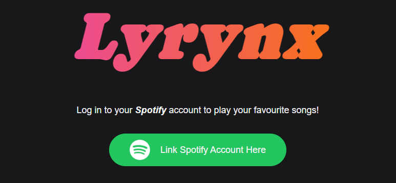
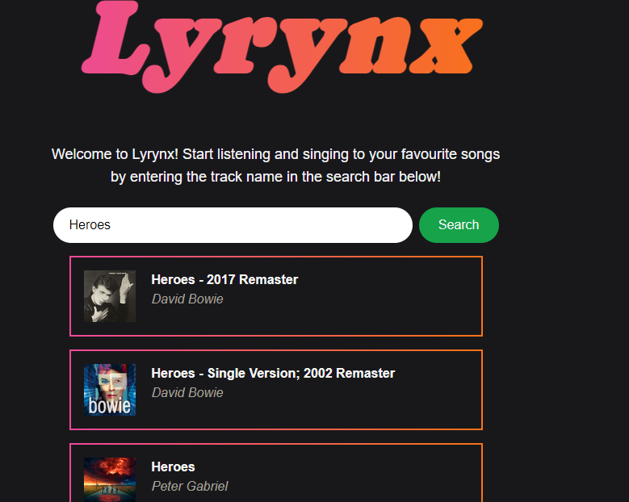
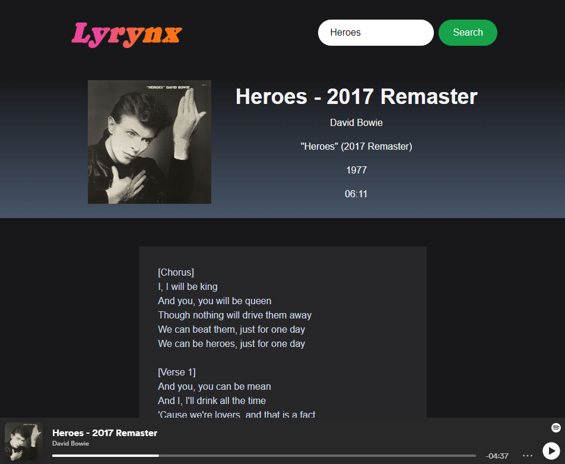
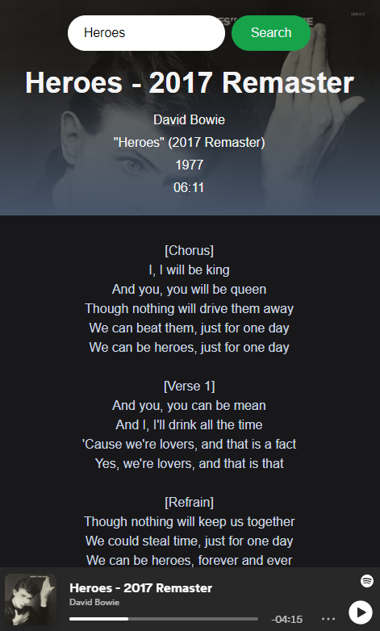

# Lyrynx
A music app that searches lyrics for any song on spotify!

## Description

This application was created so that people can listen to music with the lyrics for them to sing along to. The application uses two third-party APIs which include Spotify API and the Genius API. Throughout the process of making this application we learnt how to effectively synergise these two APIs, creating an easier, more user friendly experience.

## Usage
Visit the live page [here](https://alexbishopbootcamp.github.io/music-lyric-player/)

To use this application, first you will have to link your spotify account by clicking the Spotify button on the first page you are presented with.

Once your account has been linked you can then search the song you want to listen to using the search bar.

After the desired song has been selected you will then be taken to a page that will play the song and display the lyrics so you can sing along.
## Preview
Desktop preview:

Mobile preview:

## Credits

Collaborators on this application:

- [Huy Tran](https://github.com/trahy)

- [Eliab N](https://github.com/EliabN)

- [Alex Bishop](https://github.com/alexbishopbootcamp)

- [Daniel Bindig](https://github.com/Daniel-Bindig)

Third-party APIs used:

- [Spotify API](https://developer.spotify.com/documentation/web-api)

- [Genius API](https://docs.genius.com/)
## License
[MIT](https://choosealicense.com/licenses/mit/)
